# 🏗️ MODELO ENTIDAD-RELACIÓN (MER) - PROYECTO EDUTECH
## Arquitectura de Microservicios Completa

<div align="center">

[](https://microservices.io/)
[](https://www.postgresql.org/)
[](#📊-resumen-de-entidades)
[](https://spring.io/projects/spring-boot)

**🎓 Modelo de Datos para Plataforma Educativa EduTech**

</div>

---

## 📋 TABLA DE CONTENIDOS

1. [📊 Resumen de Entidades](#-resumen-de-entidades)
2. [🏗️ Diagrama MER Completo](#️-diagrama-mer-completo)
3. [👥 User Service](#-user-service)
4. [📚 Course Service](#-course-service)
5. [📝 Evaluation Service](#-evaluation-service)
6. [🎧 Support Service](#-support-service)
7. [🔗 Relaciones Entre Microservicios](#-relaciones-entre-microservicios)
8. [📈 Análisis de Cardinalidades](#-análisis-de-cardinalidades)
9. [🔍 Índices y Optimizaciones](#-índices-y-optimizaciones)

---

## 📊 RESUMEN DE ENTIDADES

### 🎯 **Estadísticas Generales**

| **Microservicio** | **Entidades** | **Tablas** | **Relaciones** | **Estado** |
|-------------------|---------------|------------|----------------|------------|
| **👥 User Service** | 5 entidades | 4 tablas | 3 herencias | ✅ Completo |
| **📚 Course Service** | 5 entidades | 5 tablas | 4 relaciones | ✅ Completo |
| **📝 Evaluation Service** | 6 entidades | 6 tablas | 5 relaciones | ✅ Completo |
| **🎧 Support Service** | 4 entidades | 4 tablas | 3 relaciones | ✅ Completo |
| **🔗 Total Sistema** | **20 entidades** | **19 tablas** | **15+ relaciones** | ✅ **Finalizado** |

---

## 🏗️ DIAGRAMA MER COMPLETO

### 🌐 **Arquitectura de Microservicios EduTech**

```mermaid
erDiagram
    %% USER SERVICE - Gestión de Usuarios
    USER {
        bigint id PK
        varchar first_name
        varchar last_name
        varchar email UK
        varchar password
        enum role
        boolean active
        boolean enabled
        integer failed_login_attempts
        timestamp created_at
        timestamp updated_at
    }
    
    STUDENT {
        bigint user_id PK,FK
        date enrollment_date
        varchar education_level
        varchar program
    }
    
    INSTRUCTOR {
        bigint user_id PK,FK
        date hire_date
        varchar specialization
        text biography
        integer years_experience
    }
    
    ADMINISTRATOR {
        bigint user_id PK,FK
        date hire_date
        varchar department
        varchar position
        integer access_level
    }

    %% COURSE SERVICE - Gestión de Cursos
    CATEGORY {
        bigint id PK
        varchar name UK
        text description
        timestamp created_at
        timestamp updated_at
    }
    
    COURSE {
        bigint id PK
        varchar title
        text description
        text objectives
        text requirements
        integer duration_hours
        decimal price
        integer discount_percentage
        varchar image_url
        bigint instructor_id FK
        enum level
        enum status
        boolean is_featured
        boolean is_premium
        timestamp created_at
        timestamp updated_at
        timestamp published_at
        bigint category_id FK
    }
    
    MODULE {
        bigint id PK
        varchar title
        text description
        integer order_index
        boolean published
        timestamp created_at
        timestamp updated_at
        bigint course_id FK
    }
    
    LESSON {
        bigint id PK
        varchar title
        text content
        integer order_index
        integer duration_minutes
        varchar video_url
        boolean published
        enum type
        timestamp created_at
        timestamp updated_at
        bigint module_id FK
    }
    
    RESOURCE {
        bigint id PK
        varchar name
        text description
        varchar resource_url
        varchar file_type
        bigint file_size_kb
        boolean downloadable
        timestamp created_at
        timestamp updated_at
        bigint lesson_id FK
    }

    %% EVALUATION SERVICE - Sistema de Evaluaciones
    QUIZ {
        bigint id PK
        varchar title
        text description
        bigint course_id FK
        bigint lesson_id FK
        integer passing_score
        integer time_limit_minutes
        boolean shuffle_questions
        boolean show_answers
        integer max_attempts
        boolean is_active
        timestamp created_at
        timestamp updated_at
    }
    
    QUESTION {
        bigint id PK
        text question_text
        integer order_index
        enum question_type
        text explanation
        integer points
        enum difficulty_level
        bigint quiz_id FK
    }
    
    ANSWER {
        bigint id PK
        text answer_text
        boolean is_correct
        integer order_index
        text feedback
        bigint question_id FK
    }
    
    QUIZ_ATTEMPT {
        bigint id PK
        bigint student_id FK
        bigint quiz_id FK
        double score
        double max_score
        double percentage
        boolean passed
        integer time_taken_seconds
        timestamp started_at
        timestamp completed_at
        integer attempt_number
        enum status
    }
    
    STUDENT_ANSWER {
        bigint id PK
        bigint question_id FK
        bigint answer_id FK
        text essay_answer
        boolean is_correct
        double points_earned
        timestamp submitted_at
        bigint quiz_attempt_id FK
    }
    
    STUDENT_PROGRESS {
        bigint id PK
        bigint student_id FK
        bigint course_id FK
        timestamp enrollment_date
        timestamp last_activity_date
        timestamp completion_date
        double completion_percentage
        integer lessons_completed
        integer total_lessons
        integer quizzes_completed
        integer total_quizzes
        double average_score
        integer total_time_spent_minutes
        boolean certificate_issued
        varchar certificate_url
        boolean is_completed
    }

    %% SUPPORT SERVICE - Sistema de Soporte
    TICKET_CATEGORY {
        bigint id PK
        varchar name UK
        text description
        boolean active
        integer expected_resolution_time_hours
        timestamp created_at
        timestamp updated_at
    }
    
    TICKET {
        bigint id PK
        varchar title
        text description
        enum status
        enum priority
        bigint user_id FK
        varchar user_email
        varchar user_name
        enum user_type
        bigint assigned_to FK
        bigint course_id FK
        varchar course_name
        timestamp created_at
        timestamp updated_at
        timestamp closed_at
        bigint category_id FK
        integer satisfaction_rating
        text feedback
    }
    
    MESSAGE {
        bigint id PK
        text content
        bigint sender_id FK
        varchar sender_name
        varchar sender_email
        enum sender_type
        varchar attachment_url
        varchar attachment_type
        boolean is_internal_note
        timestamp created_at
        bigint ticket_id FK
        boolean is_read
    }
    
    FAQ {
        bigint id PK
        varchar question
        text answer
        integer view_count
        integer helpful_votes
        integer unhelpful_votes
        bigint category_id FK
        timestamp created_at
        timestamp updated_at
        boolean published
        varchar search_keywords
        integer display_order
    }

    %% RELACIONES PRINCIPALES
    
    %% User Service - Herencia
    USER ||--o| STUDENT : "hereda"
    USER ||--o| INSTRUCTOR : "hereda"
    USER ||--o| ADMINISTRATOR : "hereda"
    
    %% Course Service - Jerarquía de Contenido
    CATEGORY ||--o{ COURSE : "categoriza"
    COURSE ||--o{ MODULE : "contiene"
    MODULE ||--o{ LESSON : "contiene"
    LESSON ||--o{ RESOURCE : "incluye"
    
    %% Evaluation Service - Sistema de Evaluaciones
    COURSE ||--o{ QUIZ : "tiene"
    LESSON ||--o{ QUIZ : "evalúa"
    QUIZ ||--o{ QUESTION : "contiene"
    QUESTION ||--o{ ANSWER : "tiene opciones"
    QUIZ ||--o{ QUIZ_ATTEMPT : "genera"
    QUIZ_ATTEMPT ||--o{ STUDENT_ANSWER : "registra"
    COURSE ||--o{ STUDENT_PROGRESS : "rastrea"
    
    %% Support Service - Sistema de Tickets
    TICKET_CATEGORY ||--o{ TICKET : "clasifica"
    TICKET ||--o{ MESSAGE : "contiene"
    TICKET_CATEGORY ||--o{ FAQ : "organiza"
    
    %% RELACIONES ENTRE MICROSERVICIOS (Referencias por ID)
    COURSE ||--o{ QUIZ : "curso_id"
    COURSE ||--o{ STUDENT_PROGRESS : "curso_id"
    COURSE ||--o{ TICKET : "curso_id"
```



---

## 👥 USER SERVICE

### 🏛️ **Arquitectura de Herencia**

El User Service implementa una **herencia JOINED** donde `User` es la entidad base y las especializaciones (`Student`, `Instructor`, `Administrator`) extienden la funcionalidad.

#### 📊 **Entidades del User Service**

| **Entidad** | **Tipo** | **Propósito** | **Campos Clave** |
|-------------|----------|---------------|------------------|
| **👤 User** | Base | Usuario genérico del sistema | `id`, `email`, `role`, `active` |
| **🎓 Student** | Especialización | Estudiante matriculado | `enrollment_date`, `education_level` |
| **👨‍🏫 Instructor** | Especialización | Profesor/Instructor | `specialization`, `years_experience` |
| **👨‍💼 Administrator** | Especialización | Administrador del sistema | `department`, `access_level` |
| **🏷️ UserRole** | Enum | Roles del sistema | `STUDENT`, `INSTRUCTOR`, `ADMIN` |

#### 🔗 **Relaciones Internas**
```sql
-- Herencia JOINED
users (1) -----> (0..1) students
users (1) -----> (0..1) instructors  
users (1) -----> (0..1) administrators
```

#### 📋 **Esquema SQL Optimizado**
```sql
-- Tabla base con índices optimizados
CREATE TABLE users (
    id SERIAL PRIMARY KEY,
    first_name VARCHAR(50) NOT NULL,
    last_name VARCHAR(50) NOT NULL,
    email VARCHAR(100) NOT NULL UNIQUE,
    password VARCHAR(255) NOT NULL,
    role VARCHAR(20) NOT NULL,
    active BOOLEAN NOT NULL DEFAULT true,
    enabled BOOLEAN NOT NULL DEFAULT true,
    failed_login_attempts INTEGER NOT NULL DEFAULT 0,
    created_at TIMESTAMP NOT NULL,
    updated_at TIMESTAMP NOT NULL
);

-- Índices para performance
CREATE INDEX idx_users_email ON users(email);
CREATE INDEX idx_users_role ON users(role);
CREATE INDEX idx_users_active ON users(active);
```

---

## 📚 COURSE SERVICE

### 🎯 **Jerarquía de Contenido Educativo**

El Course Service maneja la estructura jerárquica completa del contenido educativo.

#### 📊 **Entidades del Course Service**

| **Entidad** | **Nivel** | **Propósito** | **Cardinalidad** |
|-------------|-----------|---------------|------------------|
| **🏷️ Category** | 1 | Categorización de cursos | 1:N con Course |
| **📚 Course** | 2 | Curso principal | 1:N con Module |
| **📖 Module** | 3 | Módulos del curso | 1:N con Lesson |
| **📝 Lesson** | 4 | Lecciones individuales | 1:N con Resource |
| **📎 Resource** | 5 | Recursos descargables | Hoja (sin hijos) |

#### 🔗 **Relaciones en Cascada**
```sql
-- Jerarquía completa con eliminación en cascada
Category (1) -----> (*) Course -----> (*) Module -----> (*) Lesson -----> (*) Resource
```

#### 📋 **Esquema con Relaciones**
```sql
-- Cursos con referencia a instructor (User Service)
CREATE TABLE courses (
    id SERIAL PRIMARY KEY,
    title VARCHAR(100) NOT NULL,
    instructor_id BIGINT,  -- Referencia a User Service
    category_id BIGINT,
    -- ... otros campos
    FOREIGN KEY (category_id) REFERENCES categories(id)
);

-- Índices para búsquedas optimizadas
CREATE INDEX idx_courses_instructor ON courses(instructor_id);
CREATE INDEX idx_courses_featured ON courses(is_featured);
CREATE INDEX idx_courses_status ON courses(status);
```

---

## 📝 EVALUATION SERVICE

### 🎯 **Sistema de Evaluaciones Completo**

El Evaluation Service maneja todo el ciclo de evaluación académica.

#### 📊 **Entidades del Evaluation Service**

| **Entidad** | **Propósito** | **Relaciones Principales** |
|-------------|---------------|----------------------------|
| **📝 Quiz** | Examen/Evaluación | N:1 con Course, 1:N con Question |
| **❓ Question** | Pregunta individual | N:1 con Quiz, 1:N con Answer |
| **✅ Answer** | Opción de respuesta | N:1 con Question |
| **📊 QuizAttempt** | Intento de examen | N:1 con Quiz, N:1 con Student |
| **📝 StudentAnswer** | Respuesta del estudiante | N:1 con QuizAttempt |
| **📈 StudentProgress** | Progreso del estudiante | N:1 con Course, N:1 con Student |

#### 🔗 **Flujo de Evaluación**
```sql
-- Flujo completo de evaluación
Student -> QuizAttempt -> StudentAnswer -> Score Calculation -> StudentProgress
```

#### 📋 **Esquema con Métricas**
```sql
-- Sistema de progreso con métricas avanzadas
CREATE TABLE student_progress (
    id SERIAL PRIMARY KEY,
    student_id BIGINT NOT NULL,    -- Referencia a User Service
    course_id BIGINT NOT NULL,     -- Referencia a Course Service
    completion_percentage DOUBLE PRECISION NOT NULL DEFAULT 0.0,
    lessons_completed INTEGER NOT NULL DEFAULT 0,
    total_lessons INTEGER,
    quizzes_completed INTEGER NOT NULL DEFAULT 0,
    total_quizzes INTEGER,
    average_score DOUBLE PRECISION,
    total_time_spent_minutes INTEGER DEFAULT 0,
    certificate_issued BOOLEAN NOT NULL DEFAULT false,
    is_completed BOOLEAN NOT NULL DEFAULT false
);
```

---

## 🎧 SUPPORT SERVICE

### 🎯 **Sistema de Soporte Técnico**

El Support Service gestiona tickets, mensajes y FAQs para soporte al usuario.

#### 📊 **Entidades del Support Service**

| **Entidad** | **Propósito** | **Características Clave** |
|-------------|---------------|----------------------------|
| **🎫 Ticket** | Ticket de soporte | Workflow completo de estados |
| **💬 Message** | Mensajes del ticket | Conversación bidireccional |
| **🏷️ TicketCategory** | Categorías de tickets | Clasificación y SLA |
| **❓ FAQ** | Preguntas frecuentes | Base de conocimiento |

#### 🔗 **Workflow de Soporte**
```sql
-- Estados del ticket
NUEVO -> ASIGNADO -> EN_PROGRESO -> RESUELTO -> CERRADO

-- Prioridades
BAJA -> MEDIA -> ALTA -> CRÍTICA
```

#### 📋 **Esquema con Referencias**
```sql
-- Tickets con referencias a otros microservicios
CREATE TABLE tickets (
    id SERIAL PRIMARY KEY,
    user_id BIGINT NOT NULL,       -- Referencia a User Service
    course_id BIGINT,              -- Referencia a Course Service (opcional)
    assigned_to BIGINT,            -- Referencia a User Service (Admin/Support)
    status VARCHAR(20) NOT NULL,
    priority VARCHAR(20) NOT NULL,
    satisfaction_rating INTEGER,   -- 1-5 estrellas
    category_id BIGINT,
    FOREIGN KEY (category_id) REFERENCES ticket_categories(id)
);
```

---

## 🔗 RELACIONES ENTRE MICROSERVICIOS

### 🌐 **Arquitectura de Referencias**

Los microservicios se comunican a través de **referencias por ID** en lugar de Foreign Keys directas.

#### 📊 **Matriz de Dependencias**

| **Desde** | **Hacia** | **Campo de Referencia** | **Propósito** |
|-----------|-----------|-------------------------|---------------|
| Course Service | User Service | `instructor_id` | Asignar instructor al curso |
| Evaluation Service | User Service | `student_id` | Identificar estudiante |
| Evaluation Service | Course Service | `course_id`, `lesson_id` | Vincular evaluaciones |
| Support Service | User Service | `user_id`, `assigned_to` | Usuario y asignación |
| Support Service | Course Service | `course_id` | Soporte específico de curso |

#### 🔗 **Patrones de Integración**

```javascript
// Ejemplo de consulta cross-microservice
GET /api/courses/1/students-progress
// 1. Course Service obtiene curso
// 2. Evaluation Service obtiene progreso por course_id
// 3. User Service obtiene datos de estudiantes por student_id
```

---

## 📈 ANÁLISIS DE CARDINALIDADES

### 🎯 **Relaciones Principales**

#### 1️⃣ **User Service**
```
User (1) -----> (0..1) Student     [Herencia JOINED]
User (1) -----> (0..1) Instructor  [Herencia JOINED]
User (1) -----> (0..1) Administrator [Herencia JOINED]
```

#### 2️⃣ **Course Service**
```
Category (1) -----> (*) Course     [1:N - Una categoría, muchos cursos]
Course (1) -----> (*) Module       [1:N - Un curso, muchos módulos]
Module (1) -----> (*) Lesson       [1:N - Un módulo, muchas lecciones]
Lesson (1) -----> (*) Resource     [1:N - Una lección, muchos recursos]
```

#### 3️⃣ **Evaluation Service**
```
Quiz (1) -----> (*) Question       [1:N - Un quiz, muchas preguntas]
Question (1) -----> (*) Answer     [1:N - Una pregunta, muchas opciones]
Quiz (1) -----> (*) QuizAttempt    [1:N - Un quiz, muchos intentos]
QuizAttempt (1) -----> (*) StudentAnswer [1:N - Un intento, muchas respuestas]
```

#### 4️⃣ **Support Service**
```
TicketCategory (1) -----> (*) Ticket [1:N - Una categoría, muchos tickets]
Ticket (1) -----> (*) Message       [1:N - Un ticket, muchos mensajes]
TicketCategory (1) -----> (*) FAQ    [1:N - Una categoría, muchas FAQs]
```

---

## 🔍 ÍNDICES Y OPTIMIZACIONES

### ⚡ **Estrategia de Indexación**

#### 🎯 **Índices Críticos para Performance**

```sql
-- USER SERVICE
CREATE INDEX idx_users_email ON users(email);
CREATE INDEX idx_users_role ON users(role);
CREATE INDEX idx_users_active ON users(active);

-- COURSE SERVICE  
CREATE INDEX idx_courses_instructor ON courses(instructor_id);
CREATE INDEX idx_courses_category ON courses(category_id);
CREATE INDEX idx_courses_featured ON courses(is_featured);
CREATE INDEX idx_courses_status ON courses(status);
CREATE INDEX idx_modules_course ON modules(course_id);
CREATE INDEX idx_lessons_module ON lessons(module_id);

-- EVALUATION SERVICE
CREATE INDEX idx_quizzes_course ON quizzes(course_id);
CREATE INDEX idx_quiz_attempts_student ON quiz_attempts(student_id);
CREATE INDEX idx_quiz_attempts_quiz ON quiz_attempts(quiz_id);
CREATE INDEX idx_student_progress_student ON student_progress(student_id);
CREATE INDEX idx_student_progress_course ON student_progress(course_id);

-- SUPPORT SERVICE
CREATE INDEX idx_tickets_user ON tickets(user_id);
CREATE INDEX idx_tickets_course ON tickets(course_id);
CREATE INDEX idx_tickets_status ON tickets(status);
CREATE INDEX idx_tickets_priority ON tickets(priority);
CREATE INDEX idx_messages_ticket ON messages(ticket_id);
```

#### 🚀 **Optimizaciones de Consulta**

```sql
-- Consultas compuestas optimizadas
CREATE INDEX idx_courses_status_featured ON courses(status, is_featured);
CREATE INDEX idx_quiz_attempts_student_status ON quiz_attempts(student_id, status);
CREATE INDEX idx_tickets_user_status ON tickets(user_id, status);
```

---

## 📊 **ESTADÍSTICAS FINALES DEL MER**

### 🎯 **Resumen Ejecutivo**

| **Aspecto** | **Cantidad** | **Observaciones** |
|-------------|--------------|-------------------|
| **🏢 Microservicios** | 4 servicios | Arquitectura desacoplada |
| **📊 Entidades Total** | 20 entidades | Modelo completo empresarial |
| **🗄️ Tablas PostgreSQL** | 19 tablas | Esquema optimizado |
| **🔗 Relaciones Internas** | 15+ relaciones | Alta cohesión interna |
| **🌐 Referencias Cross-Service** | 5 referencias | Bajo acoplamiento |
| **⚡ Índices Optimizados** | 25+ índices | Performance empresarial |
| **📈 Escalabilidad** | Horizontal | Cada servicio independiente |

### 🏆 **Calidad Arquitectónica**

- ✅ **Normalización**: 3FN aplicada consistentemente
- ✅ **Integridad**: Constraints y validaciones completas  
- ✅ **Performance**: Índices estratégicos implementados
- ✅ **Escalabilidad**: Arquitectura preparada para crecimiento
- ✅ **Mantenibilidad**: Separación clara de responsabilidades
- ✅ **Flexibilidad**: Extensible para nuevas funcionalidades

---

<div align="center">

**🎓 Modelo Entidad-Relación - Proyecto EduTech 🎓**

*Desarrollado por **Felipe López** y **Axel Ojeda** *

[](https://www.postgresql.org/)
[](https://spring.io/)
[](https://microservices.io/)

</div>
